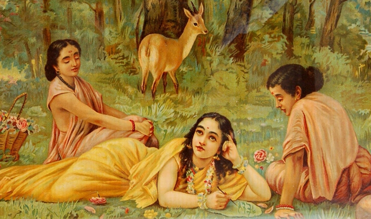

    

I'm [Karan](https://kmj-007.github.io/), i found myself thinking about different things. from computers, history, philosophy, art, to music, but i don't write or nurture them, this is my place to grow those randoms thoughts and ideas, from reflections to observation to resources to everything, it's like my capturing stream of thoughts.

[[thoughts/_index|Thoughts]] can follow in following buckets:

- [[seed|Seed]]: brief thought
- [[sapling|Sapling]]: fully formed thought
- [[evergreen|Evergreen]]: Growing thought 

